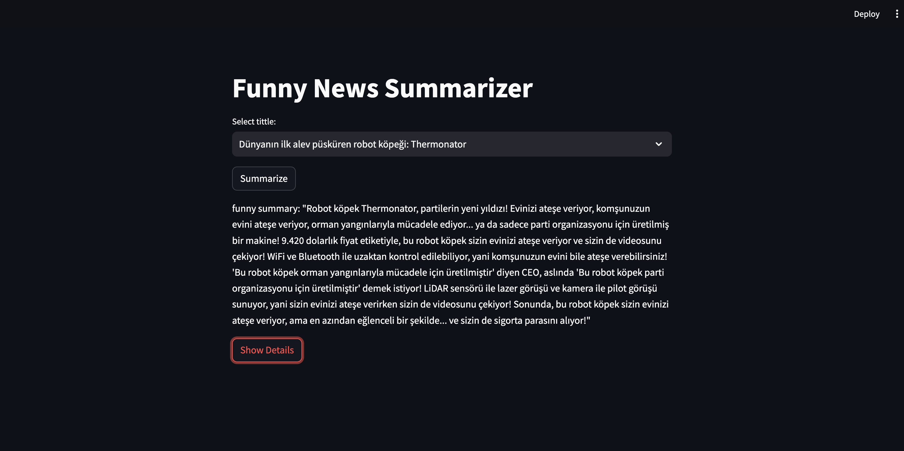
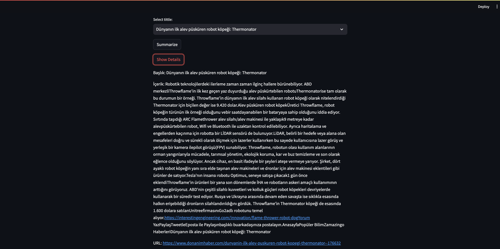

# Daily Dose Of News Humor Project !!!!!!
Funny News Summarizer: This AI-powered project takes news articles and generates humorous summaries in Turkish, designed to make readers laugh using clever jokes and witty commentary.
<br />

<p align="center">
  
</p>

<p align="center">
  This AI-powered tool generates humorous summaries of news articles in Turkish, utilizing advanced machine learning models to create entertaining content.
  <br />

## Table of Contents

- [About the Project](#about-the-project)
  
- [Getting Started](#getting-started)
  - [Prerequisites](#prerequisites)
  - [Installation](#installation)
- [Built With](#built-with)
- [Usage](#usage)
- [Groq Cloud](#GROQCLOUD)


## About the Project


<br />
<p float="left">
Funny News Summarizer
Funny News Summarizer is an innovative AI-powered tool designed to transform ordinary news articles into engaging, humorous summaries. This project utilizes advanced natural language processing techniques to interpret the content of news articles and creatively rephrase them in Turkish, ensuring the summaries not only convey the essential information but also entertain the reader with witty commentary and clever jokes.

The core of the application is built on llama3-8b-8192 model, a cutting-edge language model known for its ability to generate text that is both coherent and contextually relevant. The tool leverages this technology to analyze the tone, style, and facts of the original news content, then produces a summary that highlights the amusing aspects without compromising the news's integrity.

How It Works:
Input: The user provides the text of a news article.
Processing: The AI model processes the text, identifying key information and thematic elements.
Humor Injection: Using a custom-built humor algorithm, the tool infuses the summary with jokes and witty remarks that are relevant to the news content.
Output: The final output is a concise, humorous summary of the original article, presented in whatever language the news is in.
Features:
Language Understanding: Employs advanced NLP to deeply understand the content and context of the news.
Custom Humor Algorithm: A prompt designed algorithm to add humor that resonates with the cultural and topical nuances of the news. Prompt engineering was used to control LLMs.
User-Friendly Interface: Simple and intuitive interface, allowing users to easily input news articles and receive summaries quickly. You can view the selected news details (Title / content / url). And there is an extra button to summarize.
Multi-Article Handling: Capable of processing and summarizing multiple articles at once, providing quick and efficient outputs.
Use Cases:
Entertainment: Provides a fun way to catch up on news without the monotony of traditional news reading.
Education: Helps language learners understand news through engaging and less formal summaries.
Content Creation: Assists bloggers and content creators in producing unique and humorous content based on current events.
This tool is ideal for users looking to add a light-hearted touch to their daily news consumption or for platforms seeking to offer content that stands out in the vast sea of digital information. With its robust backend and easy-to-use frontend, the Funny News Summarizer is poised to transform how we consume news, one laugh at a time.
</p>
<br />

<p float="left">
  
  
</p>


## Getting Started


### Prerequisites

This project requires Python 3.8+ and pip. Install them if you haven't yet:

```bash
sudo apt update
sudo apt install python3-pip
```

  <br />
  
### Installation

Clone the repository:

```bash
git clone https://github.com/mertsengil/DailyDoseOfNewsHumor.git
```
<br />

### Install the required packages:

```bash
pip install -r requirements.txt
```

### Built With

- [Python](https://python.org)
- [Groq API](https://groq.com/)
- [LangChain](https://python.langchain.com/docs/integrations/chat/openai/)

  <br />
### USAGE
Run the script with the following command:
```bash
streamlit run /Users/path/app.py
```


  <br />
  
Project Link: [https://github.com/mertsengil/DailyDoseOfNewsHumor](https://github.com/mertsengil/DailyDoseOfNewsHumor)

 <br />
 
### Groq Cloud

Run the script with the following command:
```bash
export GROQ_API_KEY=<your-api-key-here>
```
 <br />
 
Install the Groq Python library:
```bash
pip install groq
```
 <br />
 
Models are:
LLaMA3 8b | LLaMA3 70b | LLaMA2 70b | Mixtral 8x7b | Gemma 7b

 <br />
 
###Question:

The project currently only works on one site due to HTML tags. How do we make this project work on all websites?


